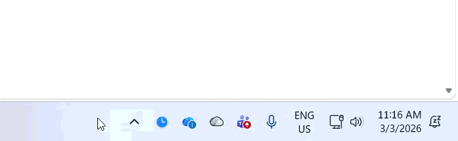

# 🕐 ClockTray — Toggle Windows Taskbar Clock

[](https://www.nuget.org/packages/ElBruno.ClockTray)
[](LICENSE)
[](https://github.com/elbruno/ElBruno.ClockTray/actions)

A lightweight Windows system tray application that lets you show or hide the taskbar date/time with a single click or keyboard shortcut.



## Features

- **System tray icon** with right-click context menu
- **Show/Hide Date & Time** in the Windows taskbar
- **Global hotkey**: `Ctrl+Alt+T` to toggle
- **Windows 11 23H2+**: Instant toggle via `WM_SETTINGCHANGE` (no Explorer restart)
- **Older Windows**: Falls back to policy registry key + Explorer restart

## Installation

### Build from source

```bash
git clone https://github.com/elbruno/ElBruno.ClockTray.git
cd ElBruno.ClockTray
dotnet build
dotnet run
```

### Publish as self-contained executable

```bash
dotnet publish -c Release -r win-x64 --self-contained
```

## Requirements

- Windows 10 or 11
- [.NET 8 SDK](https://dotnet.microsoft.com/download/dotnet/8.0)

## Usage

1. Run the app — it starts minimized to the system tray (clock icon near the Windows clock)
2. **Right-click** the tray icon to Show/Hide the taskbar date & time, or Exit
3. **Double-click** the tray icon to toggle
4. **Ctrl+Alt+T** anywhere to toggle via global hotkey

## Architecture

| File | Purpose |
|---|---|
| `Program.cs` | Entry point, runs the `ApplicationContext` |
| `ClockTrayApplicationContext.cs` | NotifyIcon, context menu, app lifecycle |
| `ClockToggler.cs` | Registry read/write + `SendMessageTimeout` P/Invoke |
| `HotkeyWindow.cs` | Global hotkey via `RegisterHotKey` P/Invoke |

## Contributing

Contributions are welcome! Please open an issue or submit a pull request.

This project could potentially evolve into a [PowerToys](https://github.com/microsoft/PowerToys) module. If you're interested in helping make that happen, let's discuss it in the issues.

## 👋 About the Author

Hi! I'm **ElBruno** 🧡, a passionate developer and content creator exploring AI, .NET, and modern development practices.

**Made with ❤️ by [ElBruno](https://github.com/elbruno)**

If you like this project, consider following my work across platforms:

- 📻 **Podcast**: [No Tienen Nombre](https://notienenombre.com) — Spanish-language episodes on AI, development, and tech culture
- 💻 **Blog**: [ElBruno.com](https://elbruno.com) — Deep dives on embeddings, RAG, .NET, and local AI
- 📺 **YouTube**: [youtube.com/elbruno](https://www.youtube.com/elbruno) — Demos, tutorials, and live coding
- 🔗 **LinkedIn**: [@elbruno](https://www.linkedin.com/in/elbruno/) — Professional updates and insights
- 𝕏 **Twitter**: [@elbruno](https://www.x.com/in/elbruno/) — Quick tips, releases, and tech news

## License

[MIT](LICENSE) © Bruno Capuano
