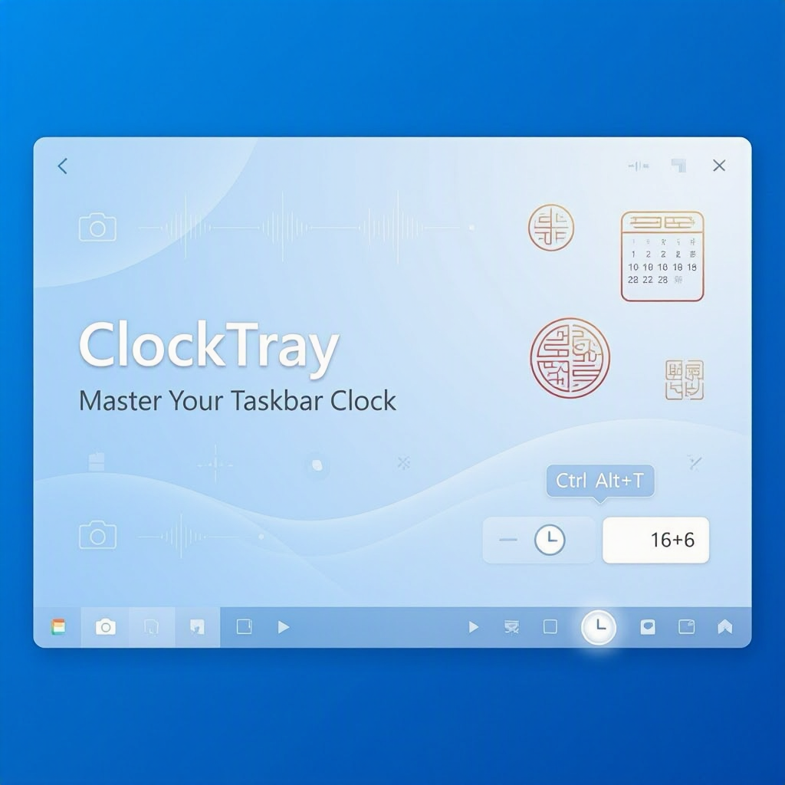

# 🕐 ClockTray: El Control de Tu Reloj en Windows que Necesitabas (¡Aunque No Lo Sabías!)



## 🎯 ¿Por Qué Tu Reloj de Windows Es Tu Peor Enemigo en Directo?

Levanta la mano si te ha pasado esto: Estás en medio de una presentación importante, streaming en vivo, o grabando un tutorial, y de repente tu pantalla muestra toda la información privada del reloj y la fecha del sistema. ¿Quién quiere que tus colegas, audiencia o cualquier persona viendo tu pantalla sepa exactamente qué hora es en tu zona horaria o qué día es hoy?

Además, ¿no es frustrante que el reloj del taskbar sea *siempre visible* y pueda distraer tanto a ti como a tu audiencia? Especialmente en presentaciones profesionales donde cada segundo cuenta y la menor distracción puede arruinar el flujo.

**Bienvenido a ClockTray**, la solución elegante y minimalista que has estado buscando para tomar *control total* sobre la visibilidad de tu reloj de Windows. 🎉

---

## 🌟 ¿Qué es ClockTray?

**ClockTray** es una herramienta revolucionaria diseñada como una **Global Tool de .NET** que se integra perfectamente en la bandeja del sistema de Windows. Su misión es simple pero poderosa: permitirte mostrar u ocultar el reloj y la fecha del taskbar de Windows con un simple clic... ¡o mejor aún, con un atajo de teclado global! ⌨️

### ⚡ Características Principales:

✨ **Acceso Instantáneo**: Oculta/muestra el reloj con `Ctrl+Alt+T` (funciona desde cualquier aplicación)

✨ **Compatible con Windows 11 23H2+**: Tecnología de última generación optimizada para el sistema operativo más moderno de Microsoft

✨ **Toggle Instantáneo**: Sin lag, sin retrasos, sin complicaciones. ¡Solo presiona y listo!

✨ **Icono en la Bandeja**: Un botón silencioso y discreto en tu system tray que está siempre disponible cuando lo necesitas

✨ **Ideal para Streamers, Presentadores y Creadores de Contenido**: Protege tu privacidad mientras te enfocas en lo que importa

---

## 🚀 Instalación: Más Fácil Que Decir "Ctrl+Alt+T"

La belleza de una Global Tool de .NET es que la instalación es absurdamente sencilla:

```bash
dotnet tool install --global ElBruno.ClockTray
```

Sí, eso es todo. Una única línea, y ClockTray estará listo para revolucionar tu experiencia en Windows. 

### Requisitos Previos:
- **.NET SDK** instalado en tu máquina (versión compatible con Global Tools)
- **Windows 11 23H2** o superior
- Un poco de valentía para cambiar tu vida 😄

---

## 📖 Cómo Usar ClockTray: La Sencillez Hecha Realidad

Una vez instalado, ClockTray es increíblemente fácil de usar:

### Opción 1: Usando el Atajo de Teclado Global
Simplemente presiona `Ctrl+Alt+T` desde *cualquier parte* de Windows:
- **Trabajando en Word?** → `Ctrl+Alt+T` y el reloj desaparece
- **Grabando un tutorial en OBS?** → `Ctrl+Alt+T` y tu privacidad está protegida
- **En medio de una presentación en PowerPoint?** → `Ctrl+Alt+T` y adiós a las distracciones

### Opción 2: Usando el Icono de la Bandeja
Haz clic en el icono de ClockTray en tu system tray (esquina inferior derecha) para alternar el estado del reloj. Es tan simple como punto y clic. 🖱️

### El Resultado:
Tu taskbar está más limpio, más profesional, y *totalmente bajo tu control*. ¡Eso es lo que llamamos una victoria! 🏆

---

## 🌙 El Toque Especial: Calendario Lunar Chino

Pero ClockTray no es solo una herramienta funcional, ¡es una obra de arte culturalmente enriquecida! 

### 🎋 Características del Calendario Lunar Chino:

**Ciclo Sexagenario (干支 - Gānzhī)**: Un sistema ancestral que combina los Diez Tallos Celestiales y las Doce Ramas Terrestres para crear un ciclo de 60 años. Cada año tiene una combinación única que determina características astrológicas.

**Zodiaco Chino (生肖 - Shēngxiào)**: Los famosos 12 signos animales (Rata, Buey, Tigre, Conejo, Dragón, Serpiente, Caballo, Cabra, Mono, Gallo, Perro, Cerdo) que capturan la esencia de cada año lunar. ¿Cuál es el tuyo? 🐉

**Términos Solares (节气 - Jiéqì)**: 24 divisiones del año solar basadas en la posición de la Tierra en su órbita alrededor del Sol. Representan cambios naturales y estacionales que han guiado la agricultura y la cultura durante miles de años.

Estos elementos no son solo curiosidades culturales; son **puentes entre la tecnología moderna y la sabiduría ancestral**. ClockTray te permite conectar con tradiciones milenarias mientras disfrutas de funcionalidades contemporáneas. 🌏✨

---

## 💡 Casos de Uso Perfectos para ClockTray

### 🎬 Streamers y Creadores de YouTube
Protege tu privacidad en tus transmisiones en vivo. Tu audiencia verá tu contenido, no tu reloj del sistema.

### 👨‍💼 Presentadores Profesionales
En pitch meetings, seminarios o webinars, un reloj visible puede indicar presión o falta de control del tiempo. ¡Elimina la distracción!

### 🎥 Grabadores de Tutoriales
Cada frame cuenta. Un taskbar limpio = contenido más profesional.

### 🔐 Trabajo Remoto Sensible
En videollamadas donde compartes pantalla, mantén tu información personal privada.

### 📸 Demostraciones de Software
Muestra tu software sin revelar detalles innecesarios del sistema.

---

## 🌐 Comunidad Open Source: ¡Tú También Puedes Contribuir!

ClockTray es **completamente open source** y vive en GitHub. Esto significa que:

🤝 **Puedes ver el código**: Sin secretos, sin sorpresas, solo código limpio y bien estructurado.

🐛 **Puedes reportar bugs**: ¿Encontraste algo que no funciona? ¡Abre un issue!

💻 **Puedes contribuir**: ¿Tienes una idea genial? ¡Fork, código, y abre un pull request!

🌟 **Puedes dar tu apoyo**: Una estrella en GitHub cuesta nada pero significa *todo* para los mantenedores.

La comunidad open source prospera gracias a personas como tú. Sin presión, pero... 😉

---

## 📥 Instalación Alternativa: NuGet

Si prefieres el ecosistema de NuGet, ClockTray también está disponible como paquete:

```
https://www.nuget.org/packages/ElBruno.ClockTray
```

---

## 🎁 Próximos Pasos

### 1. **Instala ClockTray Hoy**
```bash
dotnet tool install --global ElBruno.ClockTray
```

### 2. **Prueba tu Primer Toggle**
Presiona `Ctrl+Alt+T` y siente la magia. 🪄

### 3. **Comparte con Tu Comunidad**
¿Te encanta? Cuéntale a tus amigos, colegas, seguidores...

### 4. **Contribuye en GitHub**
⭐ Dale una estrella en: [https://github.com/elbruno/ElBruno.ClockTray](https://github.com/elbruno/ElBruno.ClockTray)

### 5. **Sigue al Creador**
Sígueme en redes sociales para estar al tanto de nuevas herramientas y actualizaciones.

---

## 🙏 Un Mensaje Final

ClockTray nació de una necesidad simple: tomar control de nuestro entorno digital. En un mundo donde cada segundo cuenta y cada distracción importa, es reconfortante saber que las herramientas pequeñas pueden tener un gran impacto.

Ya sea que uses ClockTray una vez a la semana o cien veces al día, espero que simplificar tu flujo de trabajo y te ayude a enfocarte en lo que realmente importa: **crear, compartir y crecer**.

¡Gracias por ser parte de esta aventura! 🚀

---

## 📚 Enlaces Útiles

- 🏠 **Repositorio GitHub**: [https://github.com/elbruno/ElBruno.ClockTray](https://github.com/elbruno/ElBruno.ClockTray)
- 📦 **Página NuGet**: [https://www.nuget.org/packages/ElBruno.ClockTray](https://www.nuget.org/packages/ElBruno.ClockTray)
- 📖 **Documentación Oficial**: Disponible en el repositorio

---

## Prompt para Generar Imagen del Post

**English Prompt for Image Generation (DALL-E, Midjourney, Stable Diffusion, etc.):**

```
Design a modern, sleek promotional banner for a Windows system tray tool called "ClockTray". 
The image should feature:

1. A clean Windows 11 taskbar at the bottom of the image, showcasing a minimalist system tray
2. A highlighted or glowing circular icon representing ClockTray in the system tray
3. The taskbar clock area showing the toggle between hidden and visible states (a smooth transition effect or split view)
4. Floating elements representing the features: 
   - A keyboard shortcut indicator showing "Ctrl+Alt+T"
   - Chinese lunar calendar symbols (干支, 生肖, 节气) with elegant Asian-inspired design
   - A checkmark or success icon representing "privacy protected"
5. Color scheme: Modern blues, silvers, and tech-inspired gradients with touches of traditional red/gold for the Chinese calendar elements
6. A subtle streaming/recording theme in the background (camera icon, subtle broadcast waves)
7. The product name "ClockTray" prominently displayed in bold, modern typography
8. Tagline: "Master Your Taskbar Clock" or "Control Your Privacy"
9. Overall mood: Professional, modern, trustworthy, with a touch of elegance and cultural sophistication
10. Style: Flat design with subtle shadows and depth, clean and uncluttered

The image should be 16:9 aspect ratio, suitable for a blog header. Include a subtle Windows 11 aesthetic with rounded corners and smooth animations implied through design.
```

---

*Blog post creado con ❤️ para la comunidad de desarrolladores y usuarios de Windows*
