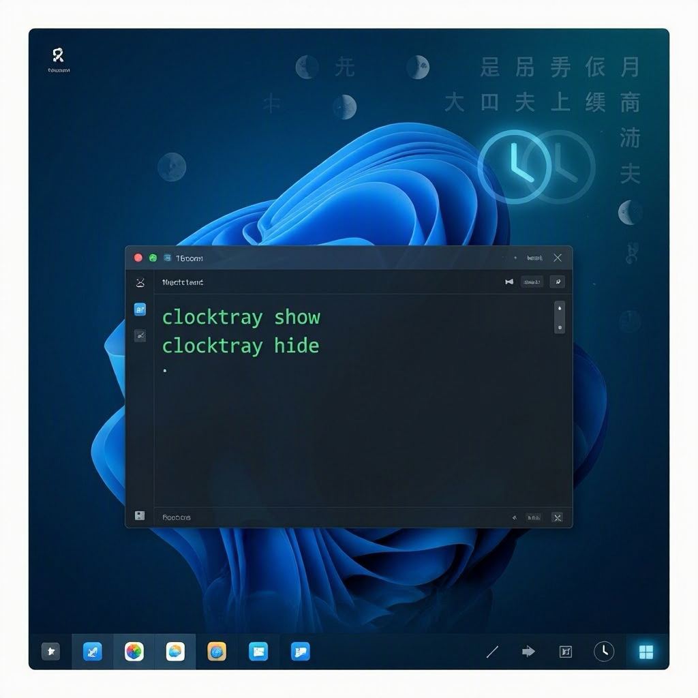

# ClockTray v1.0.0: Meet the CLI-Enabled Clock Tool for Windows



## The Problem You've Been Facing

You're working in PowerShell, managing multiple displays, streaming your desktop, or automating tasks—and Windows' taskbar clock either clutters your screen or doesn't show when you need it. You need a lightweight, scriptable clock toggle that works everywhere: in your terminal, in automation workflows, and in your GUI when you want it.

That's where **ClockTray v1.0.0** comes in.

## Introducing the CLI Revolution

We're thrilled to announce ClockTray v1.0.0—a major milestone that transforms this humble taskbar tool into a **dual-mode utility** combining a user-friendly GUI with powerful command-line controls.

The headline feature? **Full CLI support.** You can now control your taskbar clock entirely from PowerShell, batch scripts, or any automation tool. Show it, hide it, check its status—all without touching the mouse.

## The New CLI Commands

Here's what you can do right from your terminal:

```powershell
# Show the clock on your taskbar
clocktray show

# Hide the clock
clocktray hide

# Check the current status
clocktray status

# View all available commands
clocktray --help

# Check the version
clocktray --version
```

Each command is instant, non-blocking, and integrates seamlessly with your scripts and workflows.

## One Tool, Two Modes

ClockTray now works the way *you* work:

**GUI Mode:** Launch the application normally for a traditional system tray experience. Right-click the icon to toggle your clock or access settings—perfect for quick manual control.

**CLI Mode:** Run `clocktray` commands from PowerShell, Windows Terminal, or your build scripts. Perfect for automation, CI/CD pipelines, and repetitive tasks.

You don't need separate tools. You get both, in a single 30-second install.

## Automation & Real-World Use Cases

Imagine these scenarios—now all possible with ClockTray:

- **Streaming Setup:** Hide the clock before you go live, show it again when you stop.
- **Multi-Monitor Management:** Toggle the clock based on which display you're using—via a custom PowerShell profile.
- **Build Pipelines:** Hide the clock during automated testing, restore it when complete.
- **Accessibility Workflows:** Create quick-access scripts that adapt your desktop to different needs.
- **Time-Tracking Scripts:** Check the clock status as part of a larger automation routine.

PowerShell scripters and DevOps engineers, you're going to love this.

## Bonus Feature: Chinese Lunar Calendar Overlay

ClockTray also includes a beautiful overlay showing the Chinese lunar calendar—perfect if you're tracking traditional holidays, working with international teams, or simply interested in lunar dates. This overlay displays alongside your taskbar clock and respects your show/hide commands.

## Installation in 30 Seconds

You can install ClockTray as a global .NET tool from NuGet:

```powershell
dotnet tool install --global ElBruno.ClockTray
```

That's it. You'll have `clocktray` available in any PowerShell session or terminal immediately.

Update an existing installation? Use:

```powershell
dotnet tool update --global ElBruno.ClockTray
```

## Get ClockTray Today

- **GitHub:** [github.com/elbruno/ElBruno.ClockTray](https://github.com/elbruno/ElBruno.ClockTray)
- **NuGet:** [nuget.org/packages/ElBruno.ClockTray](https://www.nuget.org/packages/ElBruno.ClockTray)

Explore the source code, contribute features, or report issues on GitHub. The project is open-source and welcomes your feedback.

## What's Next

With v1.0.0 released, we're already thinking ahead. Future updates may include:

- Configuration files for default behavior
- Extended automation scenarios
- Cross-platform considerations

Your input shapes this tool. If you have ideas, open an issue or discussion on GitHub.

## Try It Now

Whether you're a PowerShell enthusiast, a DevOps engineer, or someone who just wants better desktop control, ClockTray v1.0.0 has something for you. Install it today, explore the CLI, and tell us what you build.

Happy automating. 🚀

---

## Image Generation Prompt

Create a modern, tech-forward header image showing: a dark Windows PowerShell terminal window in the foreground displaying `clocktray` CLI commands and their output (show, hide, status --help), with a Windows 11 taskbar visible in the background showing a toggling clock widget. Use a sleek dark theme with neon accents (blues and greens), professional typography, and subtle animated-feel elements suggesting control and automation. The overall aesthetic should feel developer-friendly, modern, and polished.
